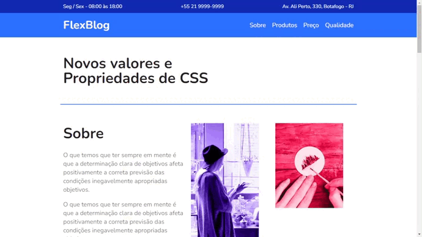

<h1>FlexBlog</h1>

> Projeto FlexBlog é uma landing page focado em aprender os fundametos do Flexbox (CSS Flexible Box Layout) -> _O layout flexível permite que os elementos responsivos dentro de um contêiner sejam organizados automaticamente, dependendo do tamanho da tela._

## 🛠 Tecnologias

- HTML
- CSS

---

_Um novo amanhã, um novo sorriso. 🌻_

[⬆ Voltar ao topo](#flexblog) 
